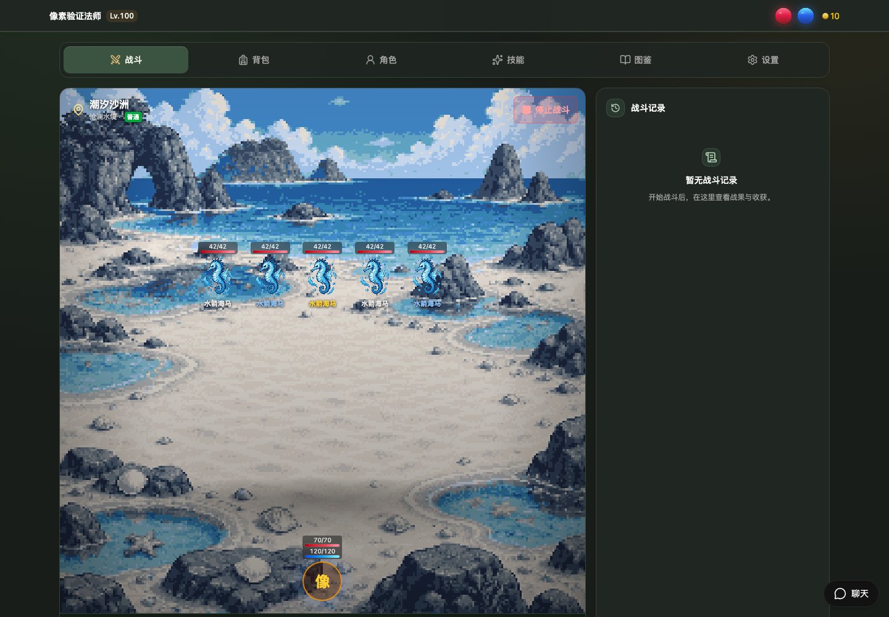
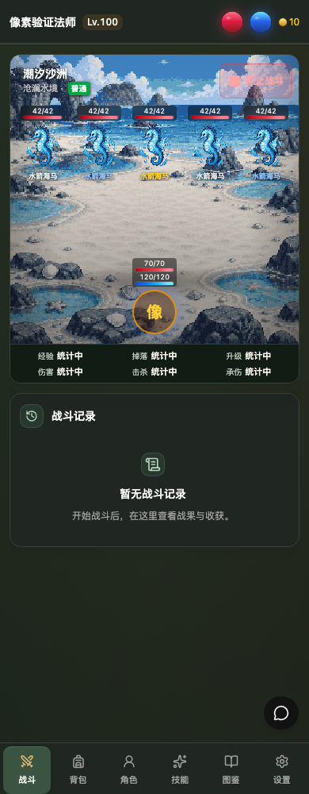
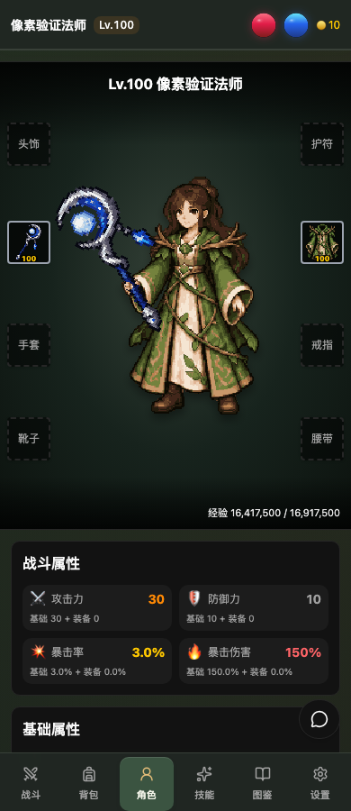
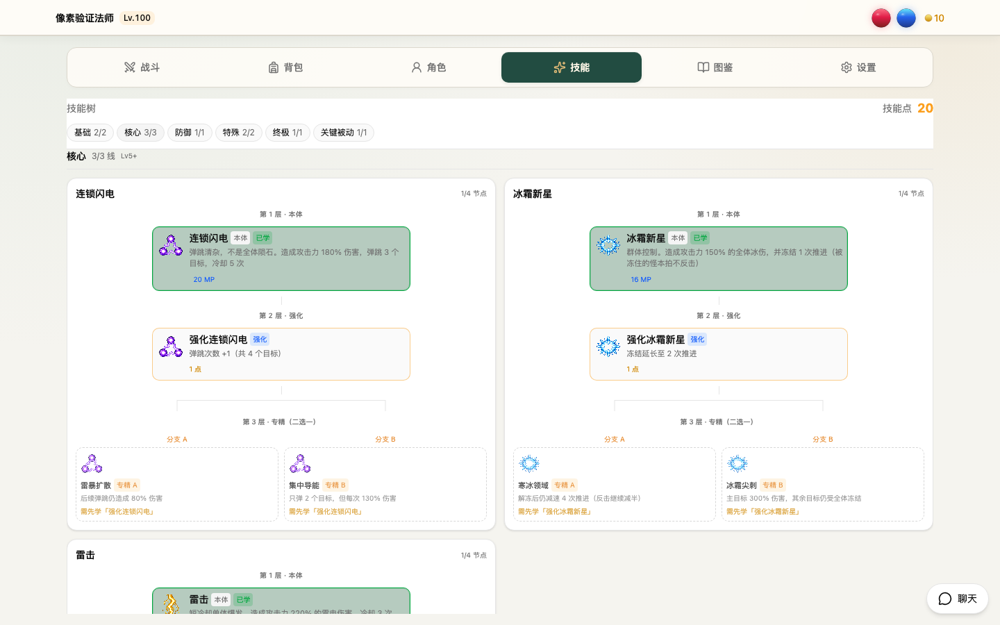
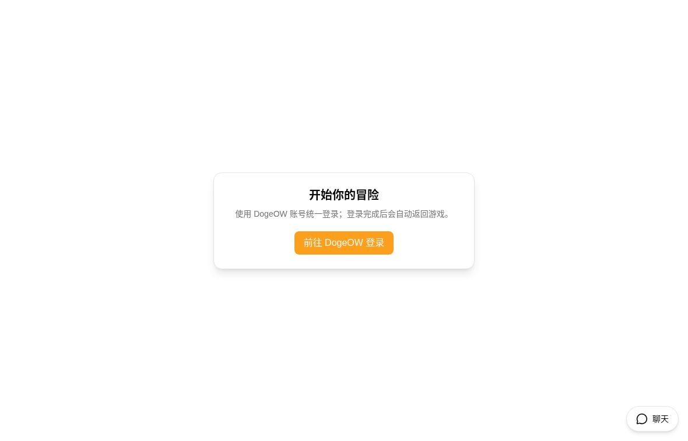

# DogeOW RPG

一款以法师成长、自动战斗和装备收集为核心的中文像素风网页 RPG。
支持桌面与手机浏览器，使用 Next.js 构建界面，由独立 Laravel API 处理角色数据与战斗结算。

**[立即游玩 → rpg.dogeow.com](https://rpg.dogeow.com/)** ·
[后端仓库](https://github.com/react-laravel/rpg-api) ·
[本地开发](#本地开发) · [项目结构](#项目结构)

## 开始游玩

1. 打开 [DogeOW RPG](https://rpg.dogeow.com/)，点击「前往 DogeOW 登录」。
2. 使用 DogeOW 账号完成统一登录，返回游戏后创建或选择角色。
3. 在「战斗」中选择可进入的地图并开始战斗；在「背包」「角色」「技能」中管理装备和成长。
4. 在「图鉴」中查看装备、怪物及掉落，在「设置」中调整音效和战斗恢复选项。

线上入口于 **2026-09-30** 核实可打开；未登录时会显示登录入口，游玩需要 DogeOW 账号。

## 界面截图

以下游戏界面截图来自仓库已有的浏览器验证记录，使用隔离测试角色与数据，**不是线上玩家存档**。
画面中的等级、数值和部分布局仅供展示；线上版本会持续更新。图片来源见[截图说明](docs/screenshots/README.md)。

### 像素地图与自动战斗



### 移动端战斗与角色装备

<p>
  
  
</p>

<details>
<summary>查看技能树与当前公开登录入口</summary>

### 技能树（隔离测试数据）



### 公开登录入口（2026-09-30 实际网页截图）



</details>

## 游戏内容

- **自动战斗**：按章节选择地图，查看怪物、HP/MP、战斗记录和经验、掉落、伤害等统计；通过 WebSocket 接收战斗更新。
- **法师成长**：技能树包含基础、核心、防御、特殊、终极和关键被动分类，以及强化和专精分支。
- **装备与宝石**：装备比较、大图预览、穿戴、强化、出售，以及宝石镶嵌与拆卸。
- **角色外观**：男女像素角色，法袍与手持武器随已装备物品变化。
- **像素世界**：八个章节、41 张地图、123 个怪物素材；七元素装备系列与装备/怪物图鉴。详见[世界地图](docs/pixel-world-plan.md)。
- **技能表现**：火球、冰箭、雷电、陨石、奥术飞弹、护盾、召唤等差异化效果；支持系统「减少动态效果」偏好。见[技能效果说明](docs/skill-effects.md)。
- **跨屏界面**：桌面顶部导航、手机底部导航、明暗主题与键盘导航。

游戏规则、掉落和数值由 API 决定；此仓库负责前端展示与交互。

## 技术栈与服务关系

| 层 | 技术 / 职责 |
| --- | --- |
| 前端 | Next.js 16、React 19、TypeScript、Tailwind CSS 4 |
| 界面与状态 | Radix UI、Zustand、SWR |
| 实时通信 | Laravel Echo、Pusher 协议客户端，对接 Laravel Reverb |
| 测试 | Vitest、Testing Library、ESLint、TypeScript |
| 配套后端 | [react-laravel/rpg-api](https://github.com/react-laravel/rpg-api)：Laravel、数据库、会话、战斗队列与广播 |

浏览器请求同源的 `/api/*` 与 `/sanctum/*`，Next.js 在服务端转发至 `RPG_API_ORIGIN`。
WebSocket 直接连接配置的 Reverb 地址，频道认证走 `/api/broadcasting/auth`。
统一登录跳转到 DogeOW 账号站点，返回 `/auth/callback` 后用一次性票据换取 RPG 会话。

**完整游玩需要前端、RPG API、DogeOW 统一账号服务和 Reverb/战斗队列配合运行。**
本仓库没有独立注册服务、数据库或离线试玩模式；只启动前端不会产生角色和战斗数据。

## 本地开发

### 环境要求

- Node.js **24.x**、npm **10 或更新版本**（仓库声明 `npm@10.9.4`）。
- 完整联调需先准备 [RPG API](https://github.com/react-laravel/rpg-api) 及其数据库、Redis、Reverb 和战斗队列。
- 登录需配置可用的 DogeOW 账号服务及对应 SSO 回调。API 端配置请对照其 [`.env.example`](https://github.com/react-laravel/rpg-api/blob/main/.env.example)，使用独立开发数据。

### 安装与启动

```bash
git clone https://github.com/react-laravel/rpg.git
cd rpg
npm ci --ignore-scripts
cp .env.example .env.local
# 编辑 .env.local，填入本地服务地址后启动
npm run dev
```

开发服务默认运行在 **<http://localhost:3001>**。
如果本机该端口被占用，可修改 `package.json` 中 `dev` 的 `-p 3001`，并同步 API 和账号服务的前端地址/回调配置。

仅查看仓库自带像素素材时，可以在启动前端后直接打开
<http://localhost:3001/game/rpg/pixel-v1/preview.html>；资源预览不需要游戏登录，也不是可玩的战斗页面。

### 环境变量

以 [`.env.example`](.env.example) 为准：

| 变量 | 示例默认值 | 用途 |
| --- | --- | --- |
| `RPG_API_ORIGIN` | `http://127.0.0.1:8001` | Next.js 服务端 API 代理目标 |
| `NEXT_PUBLIC_ACCOUNT_URL` | `http://localhost:3000` | DogeOW 统一账号前端地址 |
| `NEXT_PUBLIC_ASSET_BASE_URL` | `https://upyun.dogeow.com` | 通用远程资源根地址；已映射像素素材使用仓库本地 PNG |
| `NEXT_PUBLIC_REVERB_APP_KEY` | `rpg-local` | 与 API 配套的 Reverb 公开应用标识 |
| `NEXT_PUBLIC_REVERB_HOST` | `127.0.0.1` | 浏览器可访问的 WebSocket 主机名，不含协议 |
| `NEXT_PUBLIC_REVERB_PORT` | `8081` | WebSocket 端口 |
| `NEXT_PUBLIC_REVERB_SCHEME` | `http` | 本地用 `http`；HTTPS 站点应配套 `https`/WSS |

`NEXT_PUBLIC_*` 会进入浏览器构建产物，不要在其中放置密码、SSO 客户端密钥或 Reverb secret。
修改这些变量后需重启开发服务，生产环境需重新构建。
在手机或另一台设备访问开发服务时，`localhost`/`127.0.0.1` 指向访问设备自身，浏览器直连的账号与 Reverb 地址需相应调整。

### 常用命令

```bash
npm run lint                    # ESLint
npm run type-check              # TypeScript
npm test -- --maxWorkers=1      # 完整单元/组件测试，串行 worker 降低资源争用
npm run test:watch              # 开发时持续测试
npm run build                  # 生产构建
npm run start -- -p 3001        # 启动已构建的前端，显式指定端口
```

`npm run start` 不指定端口时沿用 Next.js 默认端口 `3000`；生产 PM2 配置使用 `3010`，与开发端口不同。
单元/组件测试使用测试环境，不要求连接线上账号或操作真实角色；完整联调仍需上述配套服务。

## 项目结构

```text
app/
  page.tsx                         游戏首页
  auth/callback/                   SSO 回调
  game/rpg/
    components/                    战斗、背包、角色、技能、图鉴和设置
    stores/                        游戏状态与 API 交互
    hooks/                         WebSocket 与界面行为
    utils/                         战斗、资源和角色外观等逻辑
    data/                          像素资源、角色外观和音效清单
components/                        通用游戏与 UI 组件
lib/api/                           同源请求、CSRF 与错误处理
lib/websocket/                     Reverb 客户端
stores/authStore.ts                登录状态
public/game/rpg/                    游戏静态素材
scripts/                           素材构建与生产部署脚本
docs/                              像素世界、技能效果和截图说明
output/                            已保留的资源源稿与验证记录
```

## 素材与开发文档

- [像素素材规范与重建](docs/pixel-art.md)
- [地图与怪物分布](docs/pixel-world-plan.md)
- [技能动画与验证](docs/skill-effects.md)
- [截图来源与更新约定](docs/screenshots/README.md)

`npm run assets:pixel` 和 `npm run assets:characters` 会根据源稿重建素材与清单，
不是普通启动或测试所必需的步骤；修改素材前请阅读对应文档并检查生成差异。

## 部署说明

[GitHub Actions](.github/workflows/deploy-self-hosted.yml) 在 `main` 收到推送或手动触发时，
通过自托管 runner 执行 [`scripts/deploy-production.sh`](scripts/deploy-production.sh)。
脚本依赖预先配置的 `.env.production`、Node/npm、rsync、PM2 和反向代理环境，
完成独立 release 构建、切换、健康检查，并在健康检查失败时尝试回退。

这份配置面向现有部署环境，不是通用的一键安装脚本。
提交前先运行 lint、类型检查、测试与构建；推送到 `main` 会触发生产部署。

## 常见问题

- **登录后无法返回游戏**：核对账号站点地址、SSO 回调、API 身份服务配置和会话 cookie 域；不要把开发地址混用成生产地址。
- **页面一直初始化或 API 请求失败**：先确认 `RPG_API_ORIGIN` 对 Next.js 服务可达，并检查 API 服务和 `/api/user` 请求。
- **战斗状态不更新**：检查 Reverb 主机、端口、协议与应用 key，以及 API 的广播认证、Redis 和战斗队列进程。
- **HTTPS 页面连不上 WebSocket**：确认使用可访问的安全 WebSocket 配置，避免混合内容。
- **音效没有播放**：浏览器通常要求先有点击等用户操作，再检查游戏音效开关与资源请求。

## 贡献与许可

欢迎通过 Issue 报告问题，或提交说明清楚、经过验证的改进。
报告界面问题时请附复现步骤、浏览器/屏幕尺寸和已去除私人信息的截图；不要提交 `.env`、密钥或登录票据。

本仓库当前未提供 `LICENSE` 文件；如需复用代码或美术资源，请先向维护者确认授权范围。
