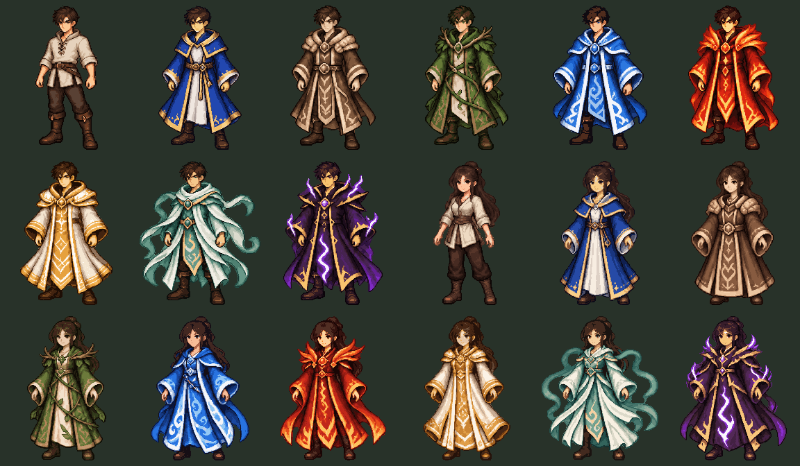

# 像素法师角色与装备外观

使用内置 `image_gen` 生成男、女角色精灵表；原始提示词和局部修正提示词保存在 [prompts.json](prompts.json)。衣服以项目已有的八件法袍图标为参考。

- 男女各九种外观：基础便装、布衣、磐石、青藤、沧澜、烈阳、鎏金、流风、雷霆。
- 角色图 192×224，男女头像 96×96，20 张透明 PNG 共 124,794 字节。
- 发布目录：`public/game/rpg/pixel-v1/characters/`。
- 当前装备的法杖直接使用现有武器像素图，独立叠加到手部，可与任意衣服组合。
- 未穿衣服时显示基础便装；卸下武器后显示空手。

运行 `npm run assets:characters` 可从 `sources/male.png` 与 `sources/female.png` 重新切分。脚本使用连通区域确定完整人物，检查透明边缘、尺寸和非空内容，并输出 `manifest.json` 校验值及前端手部定位信息。

`contact-sheet.png` 展示全部人物；`validation/` 保存界面、换装流程及 23 个浏览器场景的验证记录。生成源图和手部坐标绑定，重新生成源图后需重新校对手部位置。

