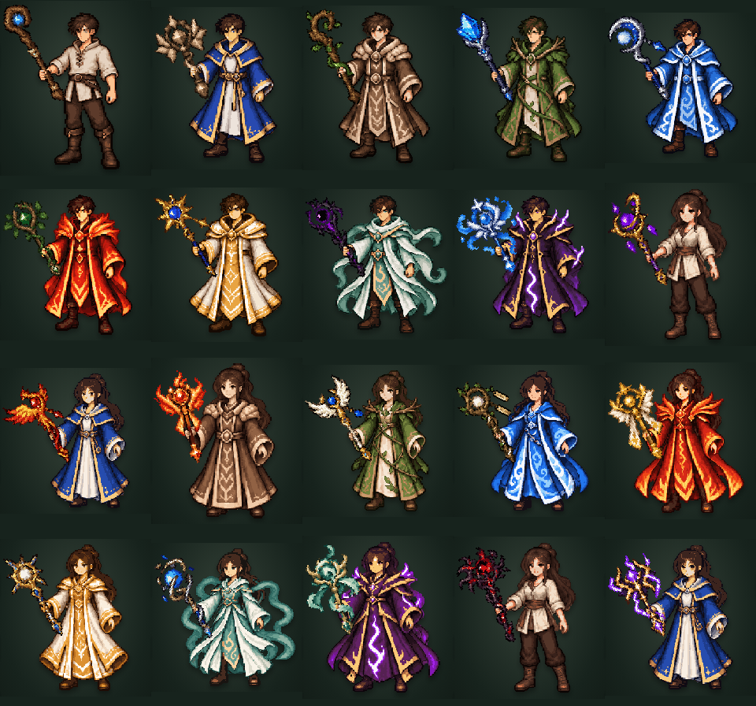

# 持杖姿势修正

使用内置 `image_gen` 在原有男女角色精灵表上重绘持杖手势。九种衣服、头发和站姿沿用原设计，持武器的手向身体外侧伸出握拳，空手时仍使用原来的自然站姿。

- 生成提示词：[prompts.json](prompts.json)。
- 男、女源图：[sources/male.png](sources/male.png)、[sources/female.png](sources/female.png)。
- 最终 18 张 `*-held.png` 和 18 张 `*-fingers.png` 位于 `public/game/rpg/pixel-v1/characters/`。
- 生成命令：`npm run assets:characters`。
- 杖身方向由各武器图片自身的杆身计算，校正为向外倾斜 28 度。
- 图层由下至上为：人物与手掌（z=0）、武器（z=10）、独立握杖手指（z=20）。手指按握拳形状从原精灵中拆出，保留透明轮廓，不包含手掌或衣袖；没有矩形整手覆盖片。杖柄完整显示在手掌和衣袖前面。
- 旋转后的透明像素边界用于计算整体尺寸，避免裁切和被装备格遮挡。浏览器验证同时检查每个武器像素的投影边界与实际三层顺序。

`validation/` 记录全部武器/衣服组合覆盖、像素边界投影检查及换装流程；其中 `male-moon-390.png` 和 `female-moon-390.png` 对应用户反馈的青藤法袍与月华法杖。

